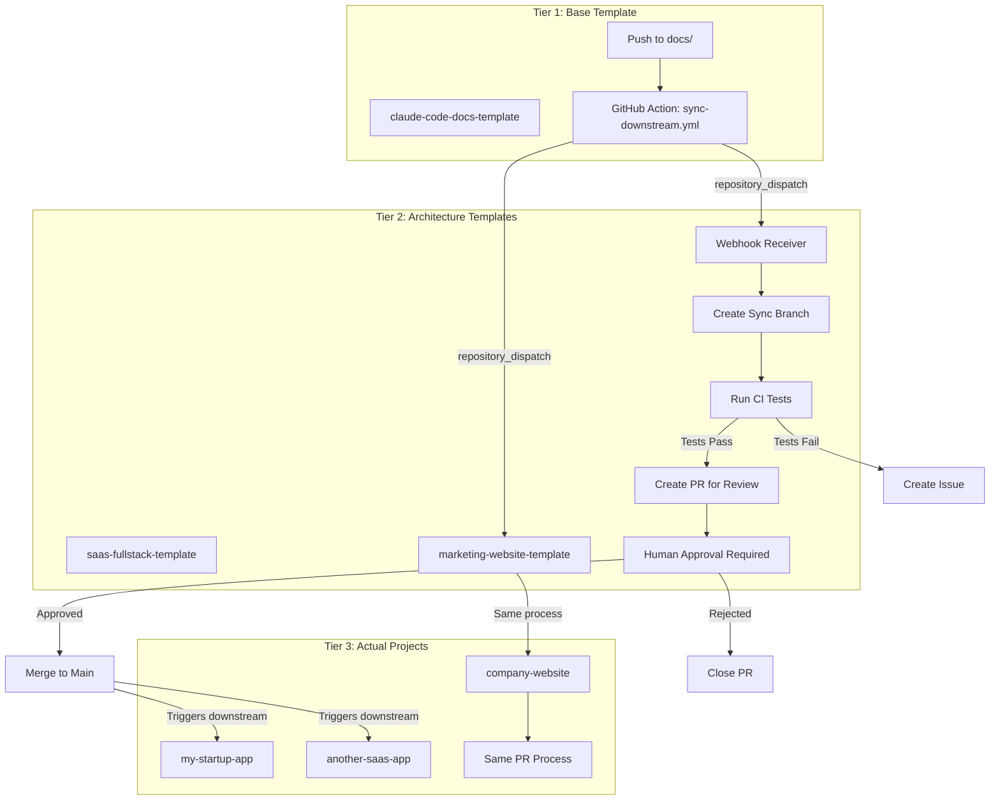
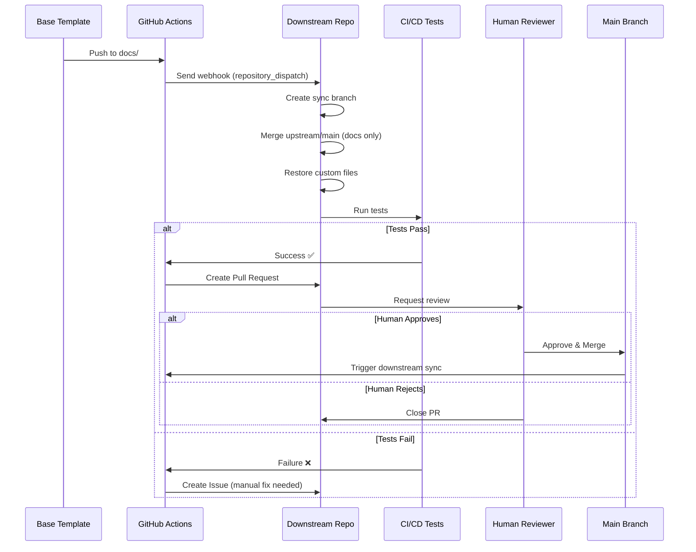
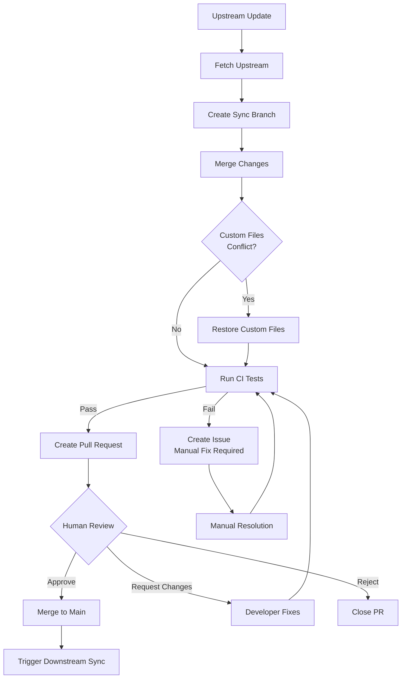
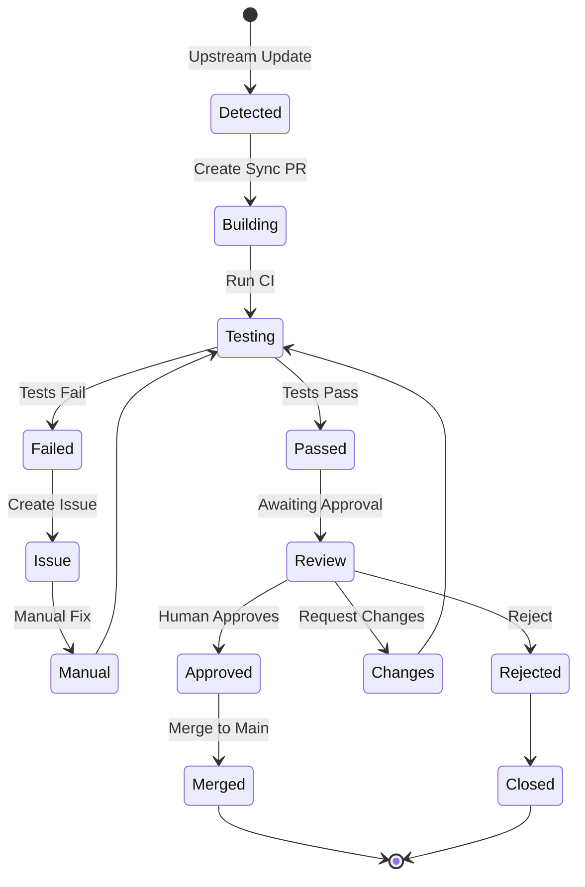

# Documentation Sync Flow Diagram

## Three-Tier Architecture



## Sync Process Detail



## Safety Checks Flow



## Protected Files Strategy

```
Repository Structure:
├── docs/
│   ├── 01-getting-started/     ⛔ NEVER synced (project-specific)
│   ├── 02-development/         Synced from upstream
│   ├── 03-architecture/        Synced from upstream
│   ├── 04-frontend/            Synced from upstream
│   ├── 06-operations/          Synced from upstream
│   ├── 07-deployment/          Synced from upstream
│   ├── 08-analytics/           Synced from upstream
│   ├── 09-saas-specific/       ⛔ NEVER synced (template-specific)
│   ├── 10-ai-workflow/         Synced from upstream
│   └── rules/                  Synced from upstream
└── CLAUDE.md                   Synced (with merge strategy)
```

## Approval Gate Workflow



## Update Propagation Timeline

```
Base Template Update
        ↓
    [1 minute]
        ↓
Webhook Triggered
        ↓
    [2 minutes]
        ↓
Sync PR Created
        ↓
    [5 minutes]
        ↓
CI Tests Complete
        ↓
    [Human Time]
        ↓
Developer Reviews
        ↓
    [1 minute]
        ↓
Approved & Merged
        ↓
    [1 minute]
        ↓
Downstream Triggered

Total Automated Time: ~10 minutes
Total with Human Review: Hours to days (depends on team)
```
